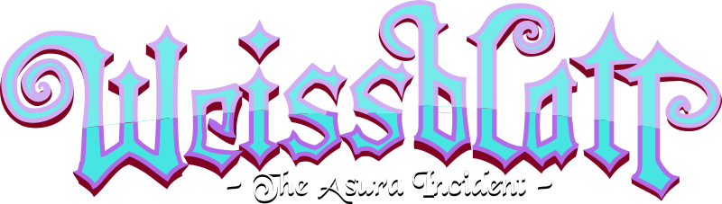

# 

*Weissblatt - The Asura Incident* is a fully-libre collaborative game project
based on the Sonic Robo Blast 2 engine, inspired by
[Freedoom](https://freedoom.github.io/) and
[LibreQuake](https://librequake.queer.sh/)

## License

TBA. As of now, we're planning to license the assets under [CC-BY-SA 4.0]
while the game engine is licensed under GNU General Public License version 2.

[CC-BY-SA 4.0]: <https://creativecommons.org/licenses/by-sa/4.0/>

## Contributing

Check out [`CONTRIBUTING.md`][Contributing] for how to contribute to the project. If you
want to reach out to the developers, check out our [Discord].

[Contributing]: CONTRIBUTING.md
[Discord]: https://discord.gg/HVTzVfAWG6
